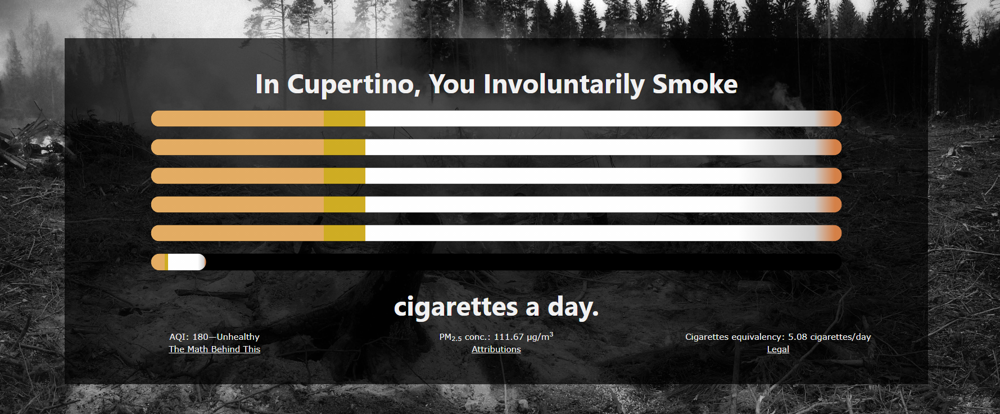

# Smoke
A website designed to promote healthy living and provide a more relatable indicator of the current air quality.
Visit me at [cigarette.cf](https://cigarette.cf/)

## Screenshots

## How do you use this?
Just click the "How much do I involuntarily smoke?" button.
This project requires javascript support, and a relatively modern browser.

## How was this implemented?
This was coded in html, CSS, and javascript. It is considered a static server so it'll run on virtually any server, including GitHub. Fun fact-- this project is being hosted right now through GitHub pages.

## Closing Statements
Alexa, remind me to renew the [API key](https://www.iqair.com/air-pollution-data-api) / [domain registration](https://freenom.com) before September 5th, 2021. :-)
